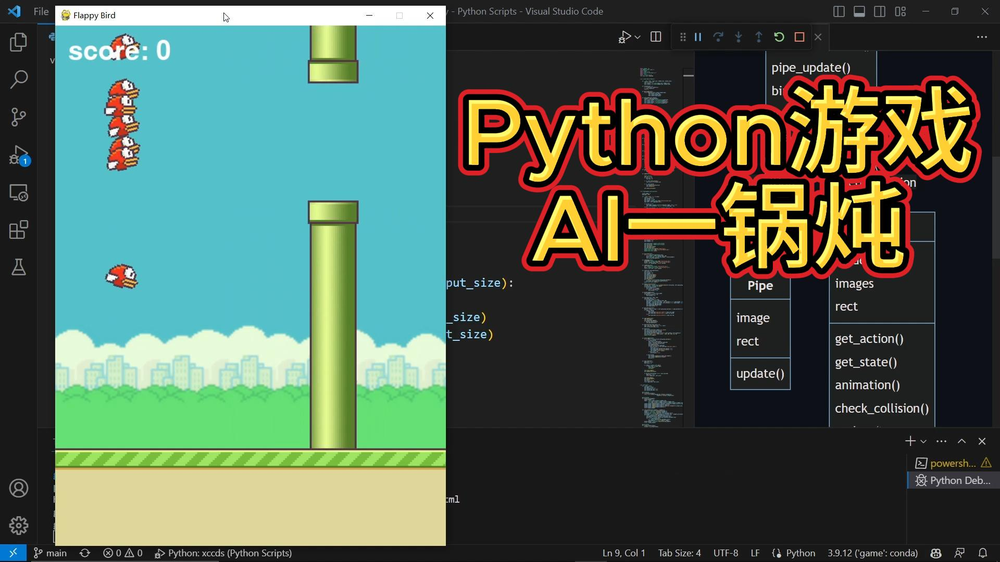
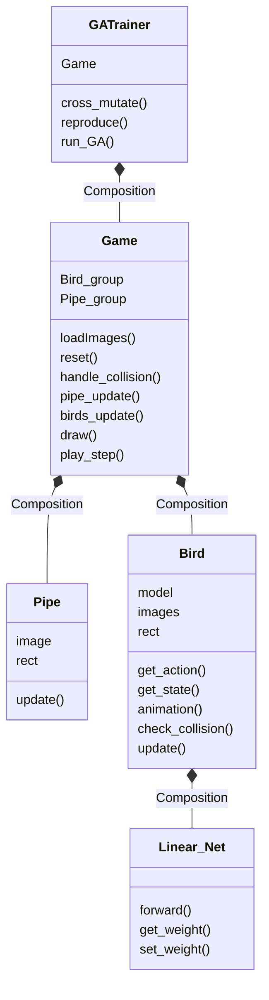

### Python游戏AI一锅炖：flappy bird游戏AI实现

用Python来编写一个经典游戏flappy bird，并且编写一个遗传算法作为AI引擎来驱动小鸟通过钢管丛林。这个有趣的小项目适合刚学习完Python语法的新手进阶。通过这个项目，可以同时学到如何用Python来开发小游戏，开发人工智能引擎，一举多得。本项目是配合 [B站的视频](https://www.bilibili.com/video/BV1ih411c7tZ/?vd_source=9823abc7527f2f96369ae2945286dc3f) 来学习。

- resources目录中存放了资源文件。
- flappy_bird.py文件是供人类玩家交互的代码。
- flappy_ga.py文件是和AI（遗传算法）交互的代码。

代码的结构类图显示如下：（只包含部分重要的属性和函数）

